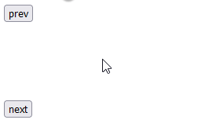

## Zadanie_1
- utwórz kontener, a w nim następujące elementy:
    - przycisk (`prev`)
    - kontener (`div`)
    - przycisk (`next`)
- w stylu css utwórz klasę, która posiada dwa właściwości:
    - szerokość: 200 pikseli
    - wysokość: 100 pikseli
- na kontenerze div, ustaw powyższą klasę
- w skrypcie utwórz funkcje lub funkcję (jedna funkcja będzie lepiej oceniona)
    - które modyfikują parametr stylu `backgroundColor`
    - wartości: `const data = [ "red", "green", "blue", "pink", "cyan" ];`
    - utwórz właśny atrybut, tak aby przechować obecny indeks koloru, który jest wyświetlany
    - zadbaj o to, aby indeks nie przekrzaczał granicznych wartośći tablicy (0 lub jej długość)
    - zadbaj o to, jeśli zwiększę lub zmniejsze rozmiar tablicy (czyli dodam nowy kolor), to zostanie on uwzględniony

Podgląd: \
    

## Zadanie_2
- utwórz kontener, a w nim następujące elementy:
    - kontrolka slider (`input, typu range`)
    - tabelka (pusta)
- kontrolka slider posiada dwa atrybuty (`min` i `max`) a ich wartośći to (1 i 7)
- kontrolka slider wywołuje skrypt, do którego przekazuje wartość z zdarzenia (`event.target.value`)
- tabelka posiada własny atrybut `id`
- zaimplementuj funkcję, która generuje dane do tabelki
    - wartość slidera, która jest przekazywana oznacza ilość kolumn, które mają zostać wyświetlone
    - dane:
    ```js
	const tableHeaders = ["gatunek", "waga", "dlugosc", "predkosc", "habitat", "zywotnosc", "druzyna"];
    const tableData = [
        ["Tygrys", "Lew", "Jaguar", "Puma", "Leopard", "Gepard", "Irbis", "Jerzyk", "Strus", "Orzelprzedni", "Sokolwedrowny", "Sokolnorweski", "Albatros"],
        ["300", "200", "100", "80", "70", "60", "50", "0,05", "150", "5", "0,7", "2", "4"],
        ["2,5", "2", "1,7", "1,7", "1,4", "1,4", "1,3", "0,2", "2,5", "0,9", "0,5", "0,7", "0,8"],
        ["60", "80", "90", "70", "85", "115", "65", "170", "70", "160", "110", "100", "120"],
        ["Azja", "Afryka", "Ameryka", "Ameryka", "Azja", "Afryka", "Azja", "Euroazja", "Afryka", "Polnoc", "Polnoc", "Polnoc", "Poludnie"],
        ["25", "29", "15", "13", "21", "12", "18", "20", "45", "20", "15", "20", "50"],
        ["Kot", "Kot", "Kot", "Kot", "Kot", "Kot", "Kot", "Ptak", "Ptak", "Ptak", "Ptak", "Ptak", "Ptak"],
    ];
    ```
    - kolejność kolumn musi być tak samo wyświetlona, jak w tablicy `tableHeaders`

Podgląd: \
    